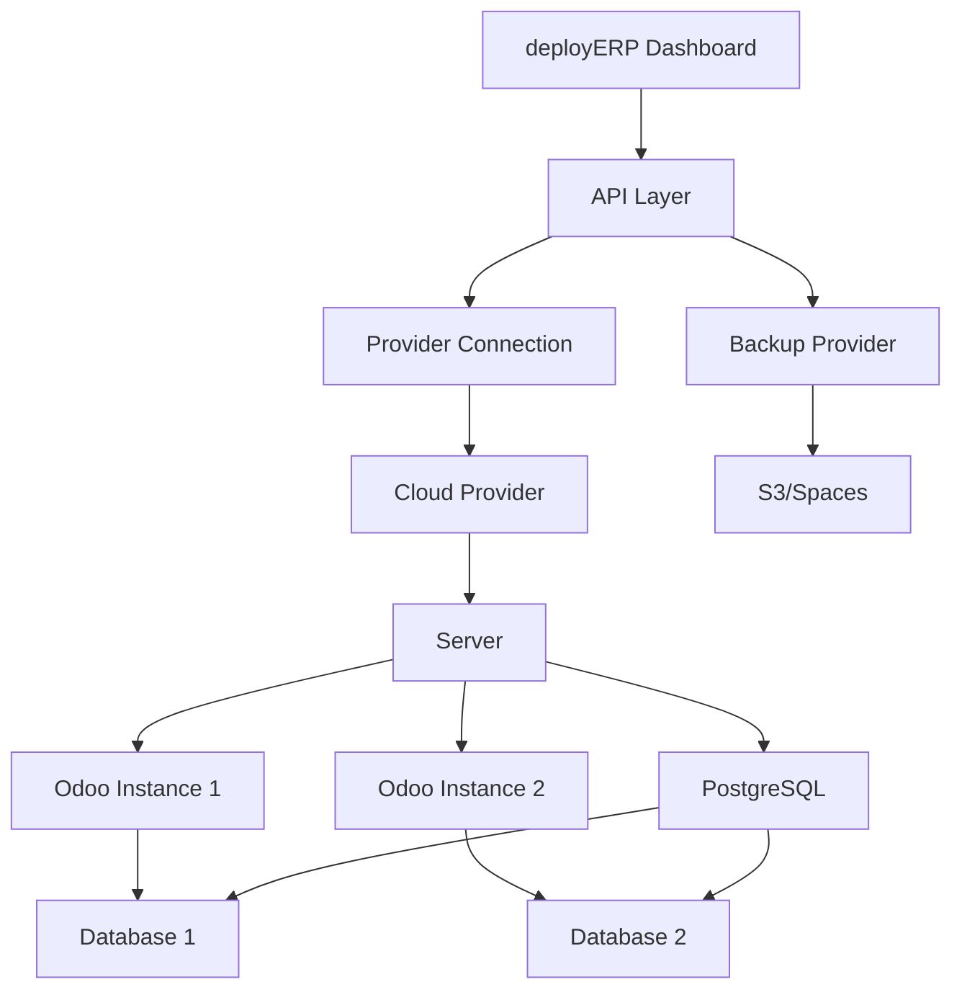

## Overview

deployERP simplifies Odoo deployment and management by abstracting complex infrastructure operations into intuitive concepts. Understanding these core components will help you make the most of the platform.

## Key Components

### Servers

A **Server** is a virtual machine provisioned on your chosen cloud provider that hosts your Odoo instances.

<Info>
  Think of a server as your dedicated hosting environment where one or more Odoo instances can run.
</Info>

**Key characteristics:**
- Dedicated resources (CPU, RAM, Storage)
- Runs on your cloud provider account
- Can host multiple Odoo instances
- Pre-configured with optimized settings
- Includes PostgreSQL database server

### Instances

An **Instance** is an individual Odoo installation running on a server.

**Instance features:**
- Separate database and filestore
- Independent Odoo configuration
- Custom domain support
- Version-specific (Odoo 14, 15, 16, 17, etc.)
- Community or Enterprise edition

<Tip>
  You can run multiple instances on a single server for cost efficiency, or dedicate servers to critical instances for maximum performance.
</Tip>

### Provider Connections

**Provider Connections** link your cloud provider accounts to deployERP, enabling automated server provisioning.

Supported providers include:
- Amazon Web Services (AWS)
- DigitalOcean
- Microsoft Azure
- Vultr
- Hetzner Cloud
- Google Cloud Platform
- Linode
- Custom servers (via agent)

### Backups

**Backups** are automated snapshots of your Odoo instances, including:
- Database dumps
- Filestore data
- Configuration files
- Custom modules

<Warning>
  Always configure automated backups for production instances. deployERP supports multiple backup providers including AWS S3, DigitalOcean Spaces, and custom S3-compatible storage.
</Warning>

### Teams

**Teams** enable collaborative management of your deployERP resources.

Team features:
- Role-based access control
- Multiple permission levels
- Audit logging
- Resource isolation

## Architecture Overview

## Deployment Flow

<Steps>
  <Step title="Connect Provider">
    Link your cloud provider account to deployERP
  </Step>
  <Step title="Provision Server">
    deployERP creates a optimized server on your infrastructure
  </Step>
  <Step title="Install Dependencies">
    Python, PostgreSQL, and Odoo requirements are automatically configured
  </Step>
  <Step title="Deploy Instance">
    Odoo is installed with your chosen version and edition
  </Step>
  <Step title="Configure Access">
    SSL certificates, domains, and security settings are applied
  </Step>
  <Step title="Enable Monitoring">
    Real-time monitoring and auto-healing are activated
  </Step>
</Steps>

## Resource Management

### Server Sizing

Choose server resources based on your needs:

| Size | vCPU | RAM | Storage | Use Case |
|------|------|-----|---------|----------|
| Small | 2 | 4GB | 80GB | Development, Testing |
| Medium | 4 | 8GB | 160GB | Small Production |
| Large | 8 | 16GB | 320GB | Standard Production |
| XLarge | 16 | 32GB | 640GB | Enterprise Production |
| Custom | Variable | Variable | Variable | Specific Requirements |

### Instance Limits

Recommended instances per server:

- **Small Server**: 1-2 instances
- **Medium Server**: 2-4 instances
- **Large Server**: 4-8 instances
- **XLarge Server**: 8-16 instances

<Note>
  Actual capacity depends on instance usage patterns, user load, and module complexity.
</Note>

## Security Model

deployERP implements multiple security layers:

1. **Infrastructure Security**
   - Encrypted API credentials
   - Isolated cloud resources
   - Network firewalls

2. **Application Security**
   - SSL/TLS encryption
   - Secure password generation
   - Session management

3. **Data Security**
   - Encrypted backups
   - Database isolation
   - Audit logging

## Monitoring & Auto-Healing

deployERP continuously monitors your infrastructure:

### Monitored Metrics
- CPU utilization
- Memory usage
- Disk space
- Database connections
- Response times
- Error rates

### Auto-Healing Actions
- Service restart on failure
- Database connection recovery
- Disk space cleanup
- Memory optimization
- Process management

## Best Practices

<CardGroup cols={2}>
  <Card title="Use Staging Instances" icon="flask">
    Test changes in staging before deploying to production
  </Card>
  <Card title="Regular Backups" icon="shield">
    Configure automated daily backups with appropriate retention
  </Card>
  <Card title="Monitor Resources" icon="chart-line">
    Track usage patterns and scale proactively
  </Card>
  <Card title="Team Permissions" icon="lock">
    Apply least-privilege access control for team members
  </Card>
</CardGroup>

## Next Steps

Now that you understand the core concepts:

- [Create your first server](/servers/provisioning)
- [Deploy an Odoo instance](/instances/creating)
- [Configure automated backups](/backups/overview)
- [Set up team access](/teams/overview)