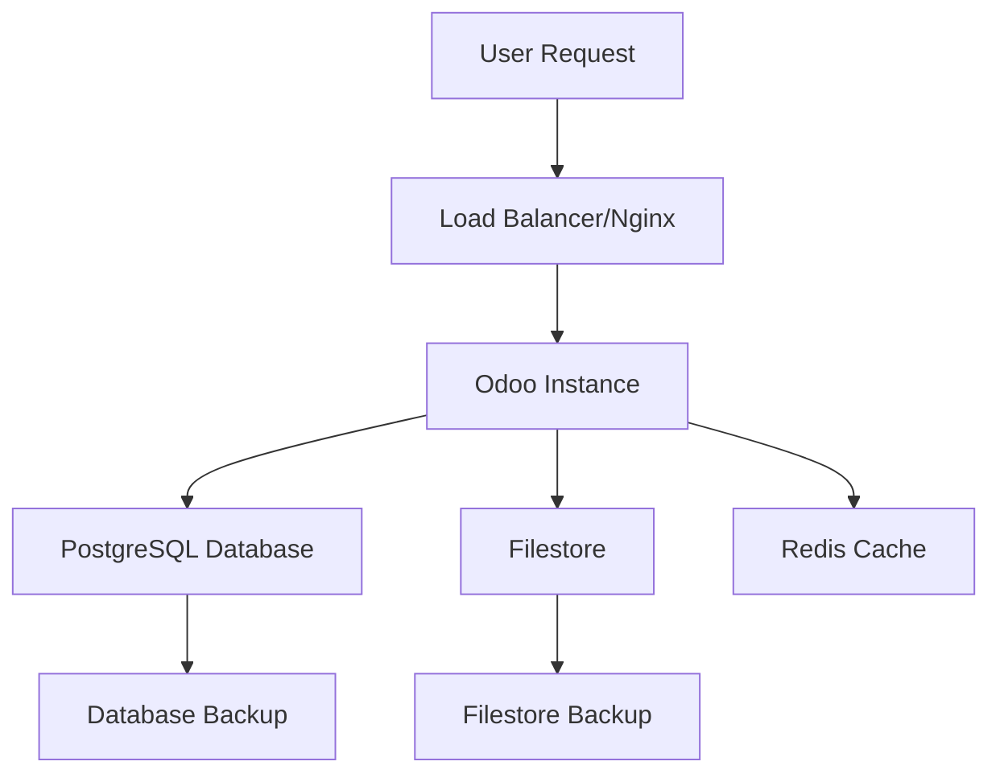

## What are Odoo Instances?

An Odoo instance is a complete, isolated Odoo installation running on a deployERP server. Each instance includes:
- Dedicated Odoo application
- Separate PostgreSQL database
- Independent filestore
- Custom configuration
- Unique domain/subdomain

<Info>
  You can run multiple instances on a single server for cost efficiency or dedicate servers to critical instances for maximum performance.
</Info>

## Instance Architecture



## Instance Types

### Production Instances
For live business operations:
- Multi-worker configuration
- Performance optimization
- Automated backups
- High availability
- SSL encryption

### Staging Instances
For testing and validation:
- Production-like environment
- Separate database
- Testing modules
- Performance profiling
- Update validation

### Development Instances
For building and customization:
- Debug mode available
- Developer tools
- Code reloading
- Lower resources
- Flexible configuration

## Supported Versions

deployERP supports all active Odoo versions:

| Version | Edition | Python | PostgreSQL | Status |
|---------|---------|--------|------------|--------|
| Odoo 17.0 | CE/EE | 3.10+ | 12+ | Active |
| Odoo 16.0 | CE/EE | 3.10+ | 12+ | Active |
| Odoo 15.0 | CE/EE | 3.8+ | 12+ | Active |
| Odoo 14.0 | CE/EE | 3.6+ | 10+ | Maintenance |

<Note>
  CE = Community Edition (Free)
  EE = Enterprise Edition (Requires license)
</Note>

## Instance Features

### Core Capabilities

<CardGroup cols={2}>
  <Card title="Custom Domains" icon="globe">
    Use your own domain with automatic SSL
  </Card>
  <Card title="Database Management" icon="database">
    Full database access and management
  </Card>
  <Card title="Module Installation" icon="puzzle-piece">
    Install custom and third-party modules
  </Card>
  <Card title="Configuration Control" icon="gear">
    Fine-tune Odoo settings and parameters
  </Card>
</CardGroup>

### Advanced Features

- **Multi-database**: Run multiple databases per instance
- **Load balancing**: Distribute traffic across workers
- **Caching**: Redis integration for performance
- **CDN Support**: Static asset delivery
- **Email Integration**: SMTP configuration
- **Scheduled Actions**: Cron job management

## Instance Configuration

### Essential Settings

```python
# Instance configuration example
{
    "name": "production-erp",
    "version": "17.0",
    "edition": "enterprise",
    "domain": "erp.company.com",
    "database": "production_db",
    "admin_email": "admin@company.com",
    "workers": 4,
    "limit_memory_hard": 2684354560,
    "limit_memory_soft": 2147483648,
    "max_cron_threads": 2
}
```

### Performance Parameters

| Parameter | Description | Default | Range |
|-----------|-------------|---------|-------|
| workers | Number of HTTP workers | 2 | 1-32 |
| max_cron_threads | Scheduled job threads | 2 | 1-8 |
| limit_memory_hard | Hard memory limit (bytes) | 2.5GB | 1-64GB |
| limit_memory_soft | Soft memory limit (bytes) | 2GB | 1-64GB |
| limit_time_cpu | CPU time limit (seconds) | 60 | 10-600 |
| limit_time_real | Real time limit (seconds) | 120 | 20-1200 |

## Instance Management

### Creating Instances

<Steps>
  <Step title="Select Server">
    Choose target server with adequate resources
  </Step>
  <Step title="Configure Version">
    Select Odoo version and edition
  </Step>
  <Step title="Set Parameters">
    Define database name, admin credentials
  </Step>
  <Step title="Deploy">
    Automated installation and configuration
  </Step>
  <Step title="Access">
    Receive URL and login credentials
  </Step>
</Steps>

### Instance Operations

Available actions for running instances:

- **Start/Stop**: Control instance state
- **Restart**: Apply configuration changes
- **Update**: Upgrade Odoo version
- **Clone**: Duplicate for testing
- **Backup**: Create manual snapshot
- **Delete**: Remove instance and data

## Database Management

### Database Operations

- Create new databases
- Duplicate existing databases
- Restore from backup
- Export/Import data
- SQL query execution
- Index optimization

### Database Access

Connect directly to PostgreSQL:
```bash
psql -h server.deployerp.io -p 5432 -U odoo -d production_db
```

<Warning>
  Direct database access should be used carefully. Always backup before making changes.
</Warning>

## Module Management

### Installing Modules

1. **From Odoo Apps Store**
   - Browse and install directly
   - Automatic dependency resolution
   - Version compatibility check

2. **Custom Modules**
   - Upload via Git integration
   - FTP/SFTP upload
   - Direct file transfer

3. **Third-party Modules**
   - OCA modules support
   - Community contributions
   - Custom repositories

### Module Updates

```bash
# Update module list
./odoo-bin -u all -d production_db

# Update specific module
./odoo-bin -u sale,purchase -d production_db
```

## Instance Monitoring

### Health Metrics

Monitor in real-time:
- Request rate
- Response time
- Error rate
- Active users
- Database size
- Memory usage

### Performance Insights

- Slow query analysis
- Request profiling
- Memory leak detection
- Cache hit rates
- Worker utilization

## Backup & Recovery

### Automated Backups

Configure automatic backups:
- **Frequency**: Hourly, Daily, Weekly
- **Retention**: 7-365 days
- **Storage**: S3, Spaces, Custom
- **Encryption**: AES-256

### Recovery Options

- **Point-in-time**: Restore to specific moment
- **Full restore**: Complete instance recovery
- **Selective restore**: Database or filestore only
- **Cross-region**: Restore to different location

## Security

### Instance Security Features

- **SSL/TLS**: Automatic HTTPS encryption
- **Firewall**: IP whitelisting available
- **Access Control**: User permission management
- **Audit Logs**: Track all activities
- **2FA**: Two-factor authentication
- **Session Management**: Timeout and controls

### Compliance

- GDPR compliance tools
- Data residency options
- Audit trail maintenance
- Data encryption at rest
- Regular security updates

## Troubleshooting

### Common Issues

| Issue | Symptoms | Solution |
|-------|----------|----------|
| Instance not starting | 500 error | Check logs, verify configuration |
| Slow performance | Long load times | Increase workers, optimize queries |
| Module errors | Installation fails | Check dependencies, compatibility |
| Database locked | Connection refused | Restart instance, check connections |

### Log Access

View logs for debugging:
```bash
# Odoo logs
tail -f /var/log/odoo/odoo.log

# PostgreSQL logs
tail -f /var/log/postgresql/postgresql.log

# Nginx logs
tail -f /var/log/nginx/access.log
```

## Best Practices

<CardGroup cols={2}>
  <Card title="Regular Updates" icon="arrow-up">
    Keep Odoo and modules updated
  </Card>
  <Card title="Test First" icon="flask">
    Use staging for testing changes
  </Card>
  <Card title="Monitor Performance" icon="chart-line">
    Track metrics and optimize regularly
  </Card>
  <Card title="Backup Strategy" icon="shield">
    Implement comprehensive backup plan
  </Card>
</CardGroup>

## Related Documentation

- [Creating Instances](/instances/creating)
- [Instance Configuration](/instances/configuration)
- [Staging Environments](/instances/staging)
- [Addon Management](/instances/addons)