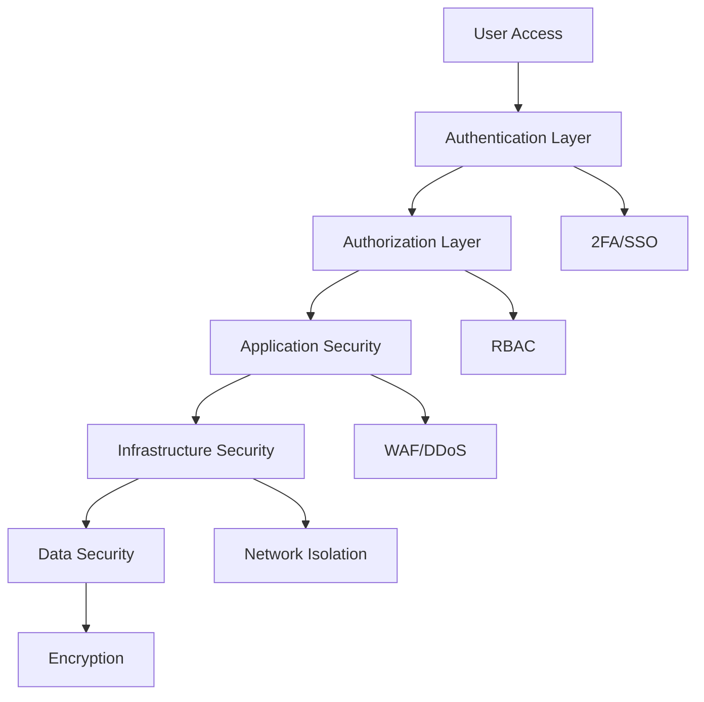

## Introduction

Security is paramount in deployERP. We implement multiple layers of protection to ensure your Odoo deployments remain secure, compliant, and protected against threats. This guide covers our security architecture and best practices.

## Security Architecture



## Security Layers

<CardGroup cols={2}>
  <Card title="Infrastructure Security" icon="server">
    - Isolated cloud resources
    - Network segmentation
    - Firewall rules
    - DDoS protection
  </Card>
  <Card title="Application Security" icon="shield">
    - Role-based access control
    - Session management
    - Input validation
    - Security headers
  </Card>
  <Card title="Data Security" icon="lock">
    - Encryption at rest
    - Encryption in transit
    - Secure backups
    - Key management
  </Card>
  <Card title="Compliance" icon="certificate">
    - GDPR ready
    - SOC 2 Type II
    - ISO 27001 aligned
    - Regular audits
  </Card>
</CardGroup>

## Authentication

### Multi-Factor Authentication (2FA)

Enable 2FA for enhanced security:

<Steps>
  <Step title="Enable 2FA">
    Go to Settings → Security → Two-Factor Authentication
  </Step>
  <Step title="Choose Method">
    Select TOTP app or SMS verification
  </Step>
  <Step title="Scan QR Code">
    Use authenticator app to scan code
  </Step>
  <Step title="Verify Setup">
    Enter verification code to confirm
  </Step>
</Steps>

### Supported 2FA Methods

| Method | Security Level | Setup Complexity | Recommended For |
|--------|---------------|------------------|-----------------|
| TOTP App | High | Medium | All users |
| SMS | Medium | Low | Basic protection |
| Hardware Key | Very High | High | Admin accounts |
| Backup Codes | Medium | Low | Recovery option |

### Single Sign-On (SSO)

Integrate with your identity provider:

<Tabs>
  <Tab title="SAML">
    ```yaml
    saml:
      enabled: true
      idp_url: https://idp.company.com
      entity_id: deployerp
      x509_cert: ${SAML_CERT}
      attribute_mapping:
        email: EmailAddress
        name: DisplayName
        groups: Groups
    ```
  </Tab>
  <Tab title="OAuth 2.0">
    ```yaml
    oauth:
      enabled: true
      providers:
        - name: google
          client_id: ${GOOGLE_CLIENT_ID}
          client_secret: ${GOOGLE_CLIENT_SECRET}
          scope: email profile
        - name: azure
          tenant_id: ${AZURE_TENANT_ID}
          client_id: ${AZURE_CLIENT_ID}
    ```
  </Tab>
  <Tab title="LDAP">
    ```yaml
    ldap:
      enabled: true
      server: ldap.company.com
      port: 636
      use_ssl: true
      bind_dn: cn=admin,dc=company,dc=com
      base_dn: ou=users,dc=company,dc=com
      user_filter: (uid=%s)
    ```
  </Tab>
</Tabs>

## Access Control

### Role-Based Access Control (RBAC)

deployERP implements granular permissions:

| Role | Permissions | Use Case |
|------|------------|----------|
| **Owner** | Full access to all resources | Account owner |
| **Admin** | Manage servers, instances, users | IT administrators |
| **Developer** | Deploy instances, view logs | Development team |
| **Operator** | Start/stop instances, backups | Operations team |
| **Viewer** | Read-only access | Stakeholders |

### Permission Matrix

| Action | Owner | Admin | Developer | Operator | Viewer |
|--------|-------|-------|-----------|----------|---------|
| Create servers | ✓ | ✓ | ✗ | ✗ | ✗ |
| Delete servers | ✓ | ✓ | ✗ | ✗ | ✗ |
| Create instances | ✓ | ✓ | ✓ | ✗ | ✗ |
| Modify instances | ✓ | ✓ | ✓ | ✓ | ✗ |
| View logs | ✓ | ✓ | ✓ | ✓ | ✓ |
| Manage backups | ✓ | ✓ | ✓ | ✓ | ✗ |
| Billing access | ✓ | ✗ | ✗ | ✗ | ✗ |

### API Key Permissions

Configure granular API key permissions:

```json
{
  "name": "deployment-key",
  "permissions": [
    "servers:read",
    "instances:create",
    "instances:read",
    "instances:update",
    "backups:create",
    "backups:read"
  ],
  "ip_whitelist": [
    "203.0.113.0/24",
    "198.51.100.0/24"
  ],
  "expires_at": "2024-12-31T23:59:59Z"
}
```

## Network Security

### Firewall Configuration

Default firewall rules:

| Port | Protocol | Source | Purpose |
|------|----------|--------|---------|
| 22 | TCP | Restricted | SSH (key-based only) |
| 80 | TCP | Any | HTTP (redirects to HTTPS) |
| 443 | TCP | Any | HTTPS |
| 5432 | TCP | Internal | PostgreSQL |
| 6379 | TCP | Internal | Redis |
| 8069 | TCP | Internal | Odoo HTTP |

### IP Whitelisting

Restrict access by IP address:

```yaml
security:
  ip_whitelist:
    enabled: true
    rules:
      - name: "Office Network"
        ips: 
          - 203.0.113.0/24
        services: ["ssh", "admin"]
      - name: "VPN"
        ips:
          - 198.51.100.0/24
        services: ["all"]
    default_action: deny
```

### DDoS Protection

Automatic DDoS mitigation:

- Rate limiting per IP
- Connection throttling
- SYN flood protection
- Application-layer filtering
- Geographic blocking (optional)

## Data Encryption

### Encryption at Rest

All data encrypted using industry standards:

| Data Type | Encryption Method | Key Management |
|-----------|------------------|----------------|
| Database | AES-256-GCM | AWS KMS / Azure Key Vault |
| File storage | AES-256-CBC | Managed keys |
| Backups | AES-256-GCM | Customer-managed keys |
| Logs | AES-256-GCM | Automatic rotation |

### Encryption in Transit

All communications encrypted:

- **TLS 1.3** for web traffic
- **SSH** for server access
- **TLS** for database connections
- **HTTPS** for API calls

### SSL/TLS Configuration

```yaml
ssl:
  # Minimum TLS version
  min_version: "TLSv1.2"
  
  # Cipher suites
  ciphers:
    - ECDHE-RSA-AES256-GCM-SHA384
    - ECDHE-RSA-AES128-GCM-SHA256
    - ECDHE-RSA-AES256-SHA384
  
  # HSTS
  hsts:
    enabled: true
    max_age: 31536000
    include_subdomains: true
    preload: true
```

## Security Monitoring

### Audit Logging

Comprehensive audit trail of all actions:

| Event Type | Information Logged | Retention |
|------------|-------------------|-----------|
| Authentication | Login attempts, 2FA usage | 90 days |
| Authorization | Permission checks, denials | 90 days |
| Resource Changes | Create, update, delete actions | 1 year |
| API Access | API key usage, endpoints | 90 days |
| Security Events | Failed attempts, blocks | 1 year |

### Security Alerts

Real-time security notifications:

```yaml
security_alerts:
  - type: failed_login
    threshold: 5
    window: 5m
    action: notify_and_block
    
  - type: privilege_escalation
    action: notify_immediately
    
  - type: unusual_api_activity
    threshold: 1000
    window: 1h
    action: rate_limit
    
  - type: geographic_anomaly
    action: require_2fa
```

### Intrusion Detection

Automated threat detection:

- Brute force attempts
- SQL injection attempts
- XSS attempts
- Suspicious file uploads
- Abnormal traffic patterns

## Compliance & Certifications

### GDPR Compliance

deployERP helps maintain GDPR compliance:

<CardGroup cols={2}>
  <Card title="Data Privacy" icon="user-shield">
    - Data minimization
    - Purpose limitation
    - Access controls
    - Audit trails
  </Card>
  <Card title="Data Rights" icon="gavel">
    - Right to access
    - Right to rectification
    - Right to erasure
    - Data portability
  </Card>
</CardGroup>

### Compliance Features

| Feature | Description | Compliance |
|---------|-------------|------------|
| Data Residency | Choose data location | GDPR, Data sovereignty |
| Encryption | End-to-end encryption | HIPAA, PCI DSS |
| Audit Logs | Complete activity trail | SOC 2, ISO 27001 |
| Access Controls | Role-based permissions | All standards |
| Data Retention | Configurable policies | GDPR, Industry specific |

## Security Best Practices

### Account Security

<AccordionGroup>
  <Accordion title="Use Strong Passwords">
    - Minimum 12 characters
    - Mix of letters, numbers, symbols
    - Unique for each service
    - Use password manager
  </Accordion>
  <Accordion title="Enable 2FA">
    - Required for admin accounts
    - Recommended for all users
    - Use TOTP apps over SMS
    - Keep backup codes secure
  </Accordion>
  <Accordion title="Regular Access Reviews">
    - Audit user permissions quarterly
    - Remove inactive accounts
    - Follow least privilege principle
    - Document access changes
  </Accordion>
</AccordionGroup>

### Infrastructure Security

<CardGroup cols={2}>
  <Card title="Keep Systems Updated" icon="arrow-up">
    - Enable automatic security updates
    - Review update logs
    - Test updates in staging
    - Plan maintenance windows
  </Card>
  <Card title="Network Segmentation" icon="network-wired">
    - Isolate production systems
    - Use private networks
    - Implement VPNs
    - Restrict public access
  </Card>
  <Card title="Regular Backups" icon="database">
    - Automated daily backups
    - Test restore procedures
    - Encrypt backup data
    - Store offsite copies
  </Card>
  <Card title="Monitor Continuously" icon="eye">
    - Enable security alerts
    - Review logs regularly
    - Investigate anomalies
    - Update security rules
  </Card>
</CardGroup>

## Incident Response

### Response Plan

In case of security incident:

<Steps>
  <Step title="Detect & Contain">
    Identify scope and contain threat
  </Step>
  <Step title="Assess Impact">
    Determine affected systems and data
  </Step>
  <Step title="Notify">
    Contact deployERP support immediately
  </Step>
  <Step title="Investigate">
    Collect logs and evidence
  </Step>
  <Step title="Remediate">
    Apply fixes and patches
  </Step>
  <Step title="Review">
    Post-incident analysis and improvements
  </Step>
</Steps>

### Emergency Contacts

| Type | Contact | Response Time |
|------|---------|---------------|
| Critical Security | security@deployerp.com | < 1 hour |
| Support | support@deployerp.com | < 4 hours |
| Abuse Reports | abuse@deployerp.com | < 24 hours |

## Security Tools

### Security Scanner

Regular vulnerability scanning:

```bash
# Run security scan
deployerp security scan --instance=production

# Output
Scanning instance: production
[✓] SSL/TLS configuration
[✓] Security headers
[✓] Open ports
[!] Outdated module: sale_custom (update available)
[✓] Database security
[✓] File permissions

Security Score: 94/100
```

### Penetration Testing

Annual third-party penetration testing:
- Application security testing
- Infrastructure testing
- Social engineering assessment
- Compliance validation

## Related Documentation

- [Access Control Details](/security/access-control)
- [Compliance Guide](/security/compliance)
- [Audit Logs](/security/audit-logs)
- [Security Hardening](/guides/security-hardening)